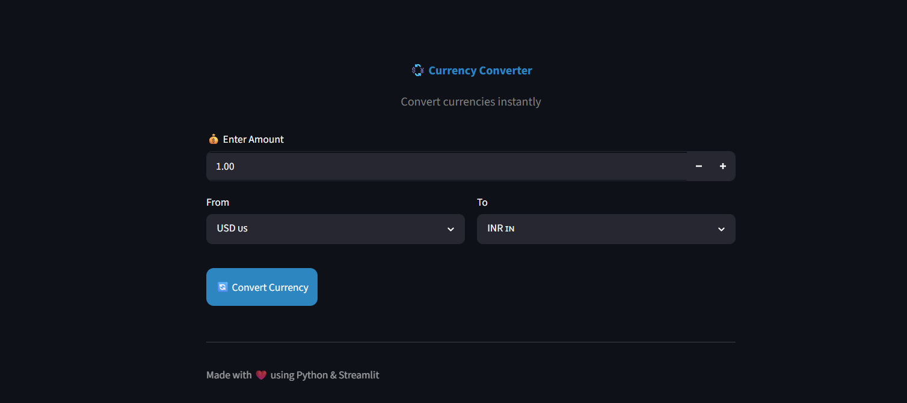
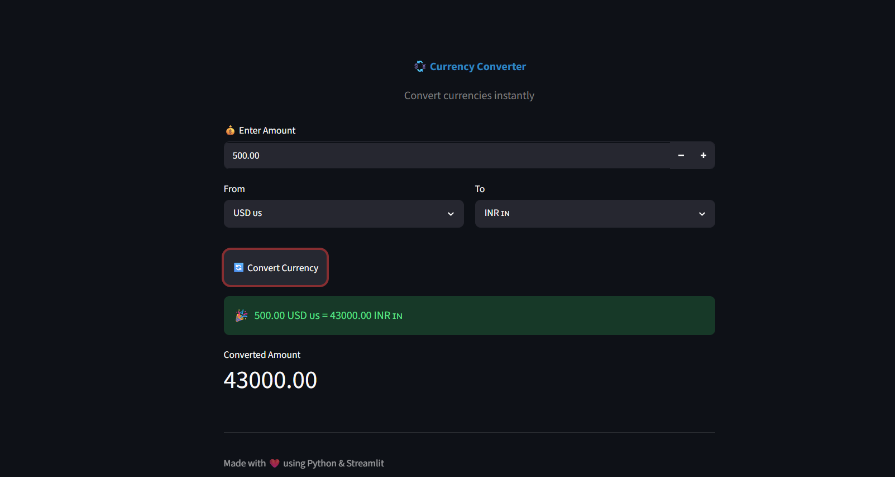

# 💱 Currency Converter

A simple and interactive **Currency Converter** web application built using **Python** and **Streamlit**.

The application allows users to convert one currency to another using predefined exchange rates through a clean, responsive, and user-friendly interface.

---

## 🚀 Features

* 💰 Convert currencies instantly
* 🌍 Multiple currency support
* 📋 Easy-to-use dropdown selection
* 🔢 Numeric amount input
* ⚡ Fast conversion
* 🎨 Clean and attractive Streamlit interface
* 📱 Responsive layout

---

## 🛠️ Technologies Used

* Python 3
* Streamlit

---

## 📂 Project Structure

```text
Currency-Converter/
│
├── app.py
├── requirements.txt
├── README.md
├── .gitignore
└── screenshots/
    ├── home.png
    └── result.png
```

---

## 📸 Screenshots

### 🏠 Home Page



---

### 💱 Conversion Result



---

## ⚙️ Installation

### 1️⃣ Clone the Repository

```bash
git clone https://github.com/YourUsername/Currency-Converter.git
```

### 2️⃣ Navigate to the Project Folder

```bash
cd Currency-Converter
```

### 3️⃣ Install Dependencies

```bash
pip install -r requirements.txt
```

### 4️⃣ Run the Application

```bash
streamlit run app.py
```

---

## 📊 Supported Currencies

* 🇺🇸 US Dollar (USD)
* 🇮🇳 Indian Rupee (INR)
* 🇪🇺 Euro (EUR)
* 🇬🇧 British Pound (GBP)
* 🇯🇵 Japanese Yen (JPY)

---

## 🔄 How It Works

1. Enter the amount to convert.
2. Select the source currency.
3. Select the target currency.
4. Click the **Convert Currency** button.
5. The application calculates the converted amount using predefined exchange rates and displays the result instantly.

---

## 📌 Future Improvements

* 🌐 Live exchange rates using an API
* 🔄 Swap Currency button
* 📈 Exchange rate chart
* 🕒 Last updated exchange rates
* 📜 Conversion history
* 📥 Download conversion history as CSV
* 🌙 Dark mode support

---

## 🤝 Contributing

Contributions are welcome!

If you'd like to improve this project, feel free to fork the repository and submit a pull request.

---

## 📄 License

This project is developed for learning and educational purposes.

---

## 👨‍💻 Author

**Siddharth Chaudhary**

If you found this project helpful, consider giving it a ⭐ on GitHub.
